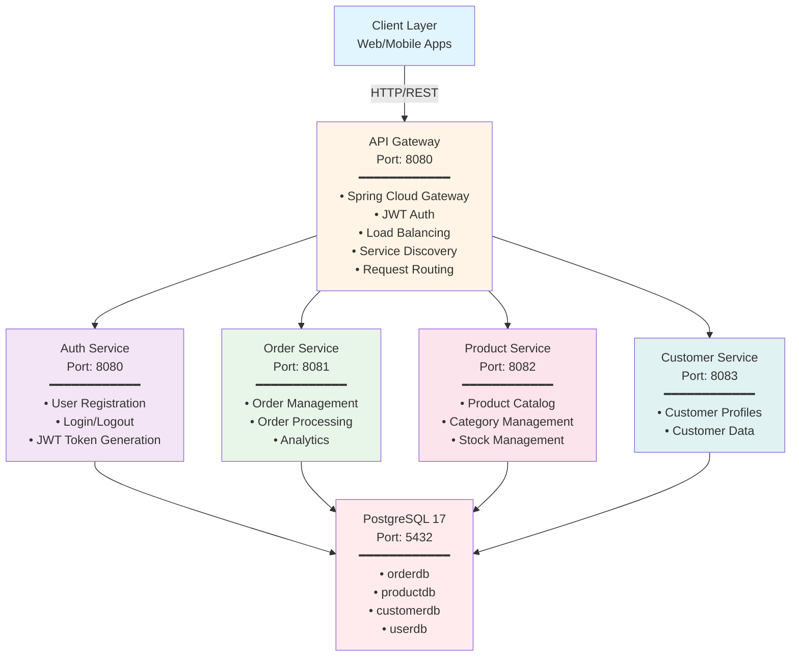
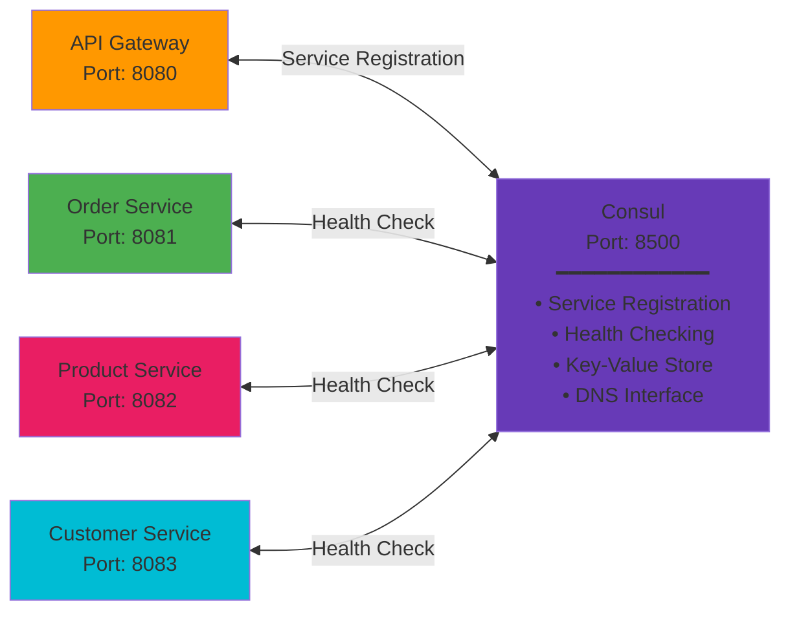
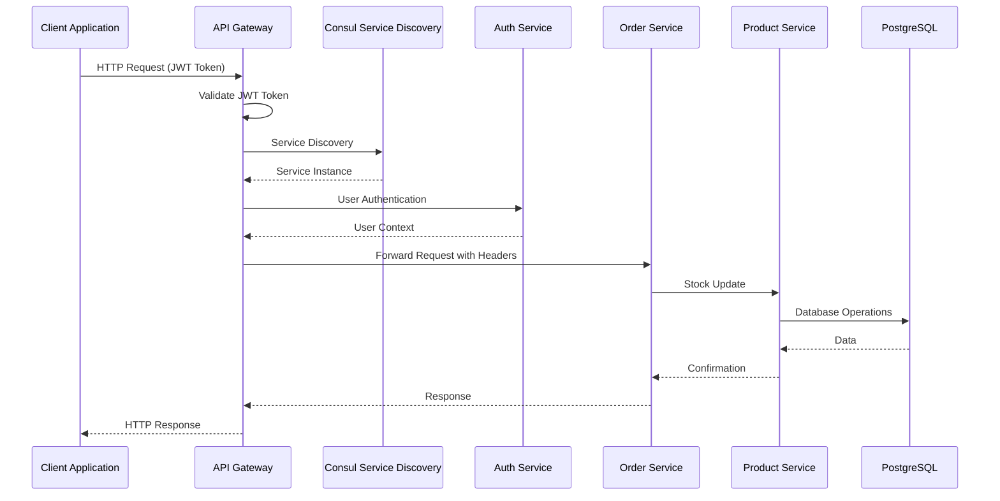
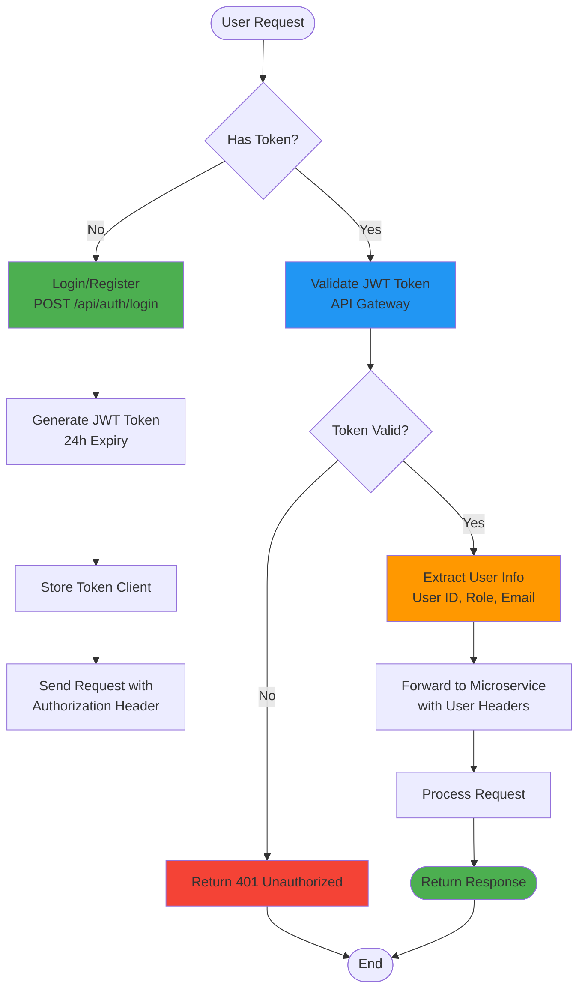

# Order Management Microservices System

**microservices-based e-commerce order management system** built with **Spring Boot 3.5.13**, **Java 21**, **Spring Cloud Gateway**, and **PostgreSQL 17**.


---

## Architecture Overview

### System Architecture



### Service Discovery & Configuration



### Microservices Communication Flow



### Authentication Flow



---

## Technology Stack

### Core Technologies
- **Java**: 21 (LTS)
- **Spring Boot**: 3.5.13
- **Spring Cloud**: 2023.0.4
- **Database**: PostgreSQL 17
- **Service Discovery**: HashiCorp Consul 1.15
- **API Gateway**: Spring Cloud Gateway
- **Containerization**: Docker & Docker Compose
- **Build Tool**: Maven 3.9.6

### Spring Boot Components
- **Spring Data JPA**: Database access
- **Spring Web**: REST APIs
- **Spring Security**: Authentication & Authorization
- **Spring Cloud Consul**: Service discovery
- **SpringDoc OpenAPI**: API documentation (Swagger UI)
- **JJWT**: JWT token generation/validation

### Database Management
- **PostgreSQL 17**: Primary database
- **pgAdmin 4**: Database management UI

---

## Services & Responsibilities

### 1. API Gateway (`api-gateway:8080`)

**Responsibilities:**
- Central entry point for all client requests
- JWT authentication and authorization
- Request routing to microservices
- Load balancing and service discovery
- Request/response filtering and transformation

**Key Features:**
- JWT token generation and validation
- User authentication (login/register)
- Role-based access control (USER, ADMIN, PRODUCT_MANAGER)
- Public and protected endpoint management
- Swagger UI aggregation

### 2. Order Service (`order-service:8081`)

**Responsibilities:**
- Order lifecycle management
- Order validation and processing
- Integration with Product Service for stock updates
- Order analytics and reporting
- Customer order history

**Database:** `orderdb`

**Key Features:**
- CRUD operations for orders
- Date-range queries
- Order status management (PENDING, PROCESSING, SHIPPED, DELIVERED)
- Real-time stock updates
- Comprehensive analytics

### 3. Product Service (`product-service:8082`)

**Responsibilities:**
- Product catalog management
- Category management
- Stock/inventory management
- Product search and filtering

**Database:** `productdb`

**Key Features:**
- CRUD operations for products and categories
- Stock level management
- Product search by name, category, price range
- In-stock products filtering

### 4. Customer Service (`customer-service:8083`)

**Responsibilities:**
- Customer profile management
- Customer information maintenance
- Customer relationship management

**Database:** `customerdb`

**Key Features:**
- CRUD operations for customers
- Customer search and filtering
- Contact information management

### 5. Infrastructure Services

#### Consul (`consul:8500`)
- Service registration and discovery
- Health checking
- Key-value configuration storage
- DNS interface for service resolution

#### PostgreSQL 17 (`postgres:5432`)
- Multi-database setup (orderdb, productdb, customerdb, userdb)
- Automatic database initialization
- Connection pooling

#### pgAdmin 4 (`pgadmin:5050`)
- Web-based database management
- Query editor and database browser
- User management and access control

---

##  Prerequisites

### Required Software

- **Docker**: 20.10+ 
- **Docker Compose**: 2.0+ (or docker-compose v1)
- **Git**: For cloning the repository
- **Java 21+**: (Optional, for local development)

### System Requirements

- **RAM**: 8GB minimum (16GB recommended)
- **Disk Space**: 10GB free space
- **OS**: Windows 10/11, macOS 10.15+, or Linux

### Verify Installation

```bash
# Check Docker
docker --version

# Check Docker Compose
docker-compose --version
# OR
docker compose version

# Check Git
git --version
```

---

## Quick Start

### 1. Clone Repository

```bash
git clone https://github.com/dihardmg/order-management.git
cd order-management
```

### 2. Start All Services

#### Using Script (Recommended)

#### Manual Start

```bash
dockercompose up -d --build
```

### 3. Verify Services

```bash
# Check service status
docker compose ps

# Health check
./start.sh health
```

### 4. Access Services

- **API Gateway**: http://localhost:8080
- **API Gateway Swagger**: http://localhost:8080/swagger-ui.html
- **Consul UI**: http://localhost:8500/ui
- **pgAdmin**: http://localhost:5050

### 5. Stop Services

```bash
docker compose down
```

---

## API Documentation

### Swagger UI Access

#### API Gateway (Recommended)
- **URL**: http://localhost:8080/swagger-ui.html
- **Features**: Complete API documentation with JWT authorization

#### Individual Services
- **Order Service**: http://localhost:8081/swagger-ui/index.html
- **Product Service**: http://localhost:8082/swagger-ui/index.html
- **Customer Service**: http://localhost:8083/swagger-ui/index.html

### API Endpoint Categories

####  Public Endpoints (No Authentication)

**Authentication:**
- `POST /api/auth/register` - User registration
- `POST /api/auth/login` - User login

**Product Catalog (Read-Only):**
- `GET /api/products` - Get all products
- `GET /api/products/{id}` - Get product by ID
- `GET /api/products/search` - Search products
- `GET /api/categories` - Get all categories
- `GET /api/categories/{id}` - Get category by ID

**Health Check:**
- `GET /actuator/health` - Service health status

####  Protected Endpoints (JWT Required)

**Order Management (USER/ADMIN):**
- `GET /api/orders` - Get all orders
- `GET /api/orders/{id}` - Get order by ID
- `GET /api/orders/customer/{customerId}` - Get customer orders
- `GET /api/orders/date-range` - Get orders by date range (LocalDate format: `2026-04-01`)
- `GET /api/orders/status/{status}` - Get orders by status
- `POST /api/orders` - Create new order
- `PATCH /api/orders/{id}` - Update order status

**Customer Management (USER/ADMIN):**
- `GET /api/customers` - Get all customers
- `GET /api/customers/{id}` - Get customer by ID
- `POST /api/customers` - Create customer
- `PUT /api/customers/{id}` - Update customer
- `DELETE /api/customers/{id}` - Delete customer

**Product & Category Management (ADMIN/PRODUCT_MANAGER):**
- `POST /api/products` - Create product
- `PUT /api/products/{id}` - Update product
- `DELETE /api/products/{id}` - Delete product
- `PATCH /api/products/{id}/stock` - Update product stock
- `POST /api/categories` - Create category
- `PUT /api/categories/{id}` - Update category
- `DELETE /api/categories/{id}` - Delete category

**Analytics (ADMIN/USER):**
- `GET /api/orders/statistics` - Order statistics
- `GET /api/orders/analytics/daily` - Daily analytics
- `GET /api/orders/analytics/category` - Category analytics
- `GET /api/orders/analytics/revenue` - Revenue trends

---

## Authentication & Authorization

### JWT Token Flow

```
1. User Registration/Login
   ↓
2. Generate JWT Token (24h expiry)
   ↓
3. Client stores token
   ↓
4. Include token in Authorization header
   ↓
5. API Gateway validates token
   ↓
6. Forward user context to microservices
   ↓
7. Process request with user permissions
```

### Getting JWT Token

#### 1. Register New User

```bash
curl -X 'POST' \
  'http://localhost:8080/api/auth/register' \
  -H 'Content-Type: application/json' \
  -d '{
    "username": "johndoe",
    "email": "john@email.com",
    "password": "password123",
    "fullName": "John Doe"
  }'
```

#### 2. Login

```bash
curl -X 'POST' \
  'http://localhost:8080/api/auth/login' \
  -H 'Content-Type: application/json' \
  -d '{
    "email": "john@email.com",
    "password": "password123"
  }'
```

**Response:**
```json
{
  "token": "eyJhbGciOiJIUzUxMiJ9.eyJzdWIiOiI1...",
  "type": "Bearer",
  "userId": 5,
  "email": "john@email.com",
  "username": "johndoe",
  "expiresIn": 86400000
}
```

### Using JWT Token

#### In Headers

```bash
curl -X 'GET' \
  'http://localhost:8080/api/orders' \
  -H 'Authorization: Bearer YOUR_JWT_TOKEN'
```

#### In Swagger UI

1. Open http://localhost:8080/swagger-ui.html
2. Click "Authorize" button (🔒)
3. Enter: `Bearer YOUR_JWT_TOKEN`
4. Click "Authorize"
5. Use protected endpoints

### User Roles

- **USER**: Can create orders, view products/customers
- **ADMIN**: Full access to all endpoints
- **PRODUCT_MANAGER**: Product/category management

---

## End-to-End Workflows

### Workflow 1: Complete Order Process

#### Step 1: User Registration & Login

```bash
# Register
curl -X 'POST' 'http://localhost:8080/api/auth/register' \
  -H 'Content-Type: application/json' \
  -d '{
    "username": "customer1",
    "email": "customer1@email.com",
    "password": "password123",
    "fullName": "Customer One"
  }'

# Login and save token
TOKEN=$(curl -X 'POST' 'http://localhost:8080/api/auth/login' \
  -H 'Content-Type: application/json' \
  -d '{
    "email": "customer1@email.com",
    "password": "password123"
  }' | jq -r '.token')
```

#### Step 2: Browse Products

```bash
# Get all products
curl -X 'GET' 'http://localhost:8080/api/products' \
  -H "Authorization: Bearer $TOKEN"

# Search products
curl -X 'GET' 'http://localhost:8080/api/products/search?name=Laptop' \
  -H "Authorization: Bearer $TOKEN"

# Get products by category
curl -X 'GET' 'http://localhost:8080/api/products/category?category=Electronics' \
  -H "Authorization: Bearer $TOKEN"
```

#### Step 3: Create Order

```bash
# Create order with items
curl -X 'POST' 'http://localhost:8080/api/orders' \
  -H "Authorization: Bearer $TOKEN" \
  -H 'Content-Type: application/json' \
  -d '{
    "customerId": 1,
    "items": [
      {
        "productId": 1,
        "quantity": 2
      },
      {
        "productId": 3,
        "quantity": 1
      }
    ]
  }'
```

#### Step 4: Monitor Order Status

```bash
# Get order by ID
curl -X 'GET' 'http://localhost:8080/api/orders/1' \
  -H "Authorization: Bearer $TOKEN"

# Get customer orders
curl -X 'GET' 'http://localhost:8080/api/orders/customer/1' \
  -H "Authorization: Bearer $TOKEN"

# Get orders by date range
curl -X 'GET' 'http://localhost:8080/api/orders/date-range?startDate=2026-04-01&endDate=2026-04-30' \
  -H "Authorization: Bearer $TOKEN"
```

### Workflow 2: Product Management (Admin)

#### Step 1: Admin Login

```bash
ADMIN_TOKEN=$(curl -X 'POST' 'http://localhost:8080/api/auth/login' \
  -H 'Content-Type: application/json' \
  -d '{
    "email": "admin@system.com",
    "password": "admin123"
  }' | jq -r '.token')
```

#### Step 2: Create Category

```bash
curl -X 'POST' 'http://localhost:8080/api/categories' \
  -H "Authorization: Bearer $ADMIN_TOKEN" \
  -H 'Content-Type: application/json' \
  -d '{
    "name": "Smartphones",
    "description": "Mobile phones and accessories"
  }'
```

#### Step 3: Create Product

```bash
curl -X 'POST' 'http://localhost:8080/api/products' \
  -H "Authorization: Bearer $ADMIN_TOKEN" \
  -H 'Content-Type: application/json' \
  -d '{
    "name": "iPhone 15 Pro",
    "description": "Latest iPhone with A17 Pro chip",
    "price": 999.99,
    "stock": 50,
    "categoryId": 1
  }'
```

#### Step 4: Update Stock

```bash
curl -X 'PATCH' 'http://localhost:8080/api/products/1/stock?quantity=-5' \
  -H "Authorization: Bearer $ADMIN_TOKEN"
```

### Workflow 3: Analytics & Reporting

#### Get Order Statistics

```bash
curl -X 'GET' \
  'http://localhost:8080/api/orders/statistics?startDate=2026-04-01&endDate=2026-04-30' \
  -H "Authorization: Bearer $TOKEN"
```

**Response:**
```json
{
  "totalOrders": 150,
  "totalRevenue": 45000.00,
  "averageOrderValue": 300.00,
  "statusBreakdown": {
    "PENDING": 45,
    "PROCESSING": 30,
    "SHIPPED": 50,
    "DELIVERED": 25
  }
}
```

#### Get Daily Analytics

```bash
curl -X 'GET' \
  'http://localhost:8080/api/orders/analytics/daily?startDate=2026-04-01&endDate=2026-04-30' \
  -H "Authorization: Bearer $TOKEN"
```

### Workflow 4: Customer Management

#### Create Customer Profile

```bash
curl -X 'POST' 'http://localhost:8080/api/customers' \
  -H "Authorization: Bearer $TOKEN" \
  -H 'Content-Type: application/json' \
  -d '{
    "firstName": "Jane",
    "lastName": "Smith",
    "email": "jane.smith@email.com",
    "phone": "+1234567890",
    "address": {
      "street": "123 Main St",
      "city": "New York",
      "state": "NY",
      "zipCode": "10001",
      "country": "USA"
    }
  }'
```

#### Update Customer Information

```bash
curl -X 'PUT' 'http://localhost:8080/api/customers/1' \
  -H "Authorization: Bearer $TOKEN" \
  -H 'Content-Type: application/json' \
  -d '{
    "firstName": "Jane",
    "lastName": "Johnson",
    "email": "jane.johnson@email.com",
    "phone": "+0987654321",
    "address": {
      "street": "456 Oak Ave",
      "city": "Los Angeles",
      "state": "CA",
      "zipCode": "90001",
      "country": "USA"
    }
  }'
```

---

## Development Guide

### Running Services Locally (Development)

```bash
# Start infrastructure & all services

docker-compose up -d --build
```

### Database Access

#### pgAdmin Setup

1. Access: http://localhost:5050
2. Login: `admin@admin.com` / `admin123`
3. Add server connection:
   - **Host**: `localhost atau postgres`
   - **Port**: `5432`
   - **Username**: `admin`
   - **Password**: `admin123`

#### Direct PostgreSQL Access

```bash
# Connect to PostgreSQL
docker exec -it postgres psql -U admin

# Switch to specific database
\c orderdb
\c productdb
\c customerdb
\c userdb

# List tables
\dt

# Run queries
SELECT * FROM orders;
SELECT * FROM products;
SELECT * FROM customers;
```


---

### Monitoring & Logs

```bash
# View all logs
docker-compose logs -f

# View specific service logs
docker-compose logs -f order-service

# Monitor service health
./monitor.sh
```

---

## Monitoring & Management

### Service Health Monitoring

```bash
# Check all services health
curl http://localhost:8080/actuator/health
curl http://localhost:8081/actuator/health
curl http://localhost:8082/actuator/health
curl http://localhost:8083/actuator/health
```

### Consul Service Catalog

Access: http://localhost:8500/ui/dc1/services

- View all registered services
- Check service health status
- Monitor service instances

## Configuration Reference

### Environment Variables

#### API Gateway

```bash
SPRING_APPLICATION_NAME=api-gateway
SPRING_CLOUD_CONSUL_HOST=consul
SPRING_CLOUD_CONSUL_PORT=8500
SERVER_PORT=8080
JWT_SECRET=your-secret-key
JWT_EXPIRATION=86400000
```

#### Order Service

```bash
SPRING_APPLICATION_NAME=order-service
SERVER_PORT=8081
SPRING_DATASOURCE_URL=jdbc:postgresql://postgres:5432/orderdb
SPRING_DATASOURCE_USERNAME=admin
SPRING_DATASOURCE_PASSWORD=admin123
PRODUCT_SERVICE_BASE_URL=http://product-service:8082
```

#### Product Service

```bash
SPRING_APPLICATION_NAME=product-service
SERVER_PORT=8082
SPRING_DATASOURCE_URL=jdbc:postgresql://postgres:5432/productdb
SPRING_DATASOURCE_USERNAME=admin
SPRING_DATASOURCE_PASSWORD=admin123
```

#### Customer Service

```bash
SPRING_APPLICATION_NAME=customer-service
SERVER_PORT=8083
SPRING_DATASOURCE_URL=jdbc:postgresql://postgres:5432/customerdb
SPRING_DATASOURCE_USERNAME=admin
SPRING_DATASOURCE_PASSWORD=admin123
```
---
